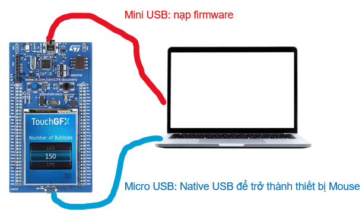
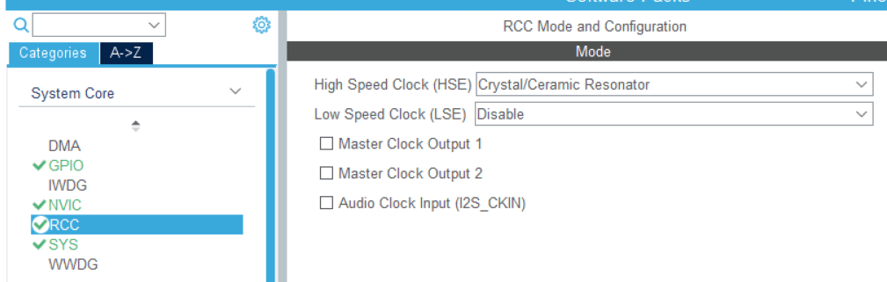
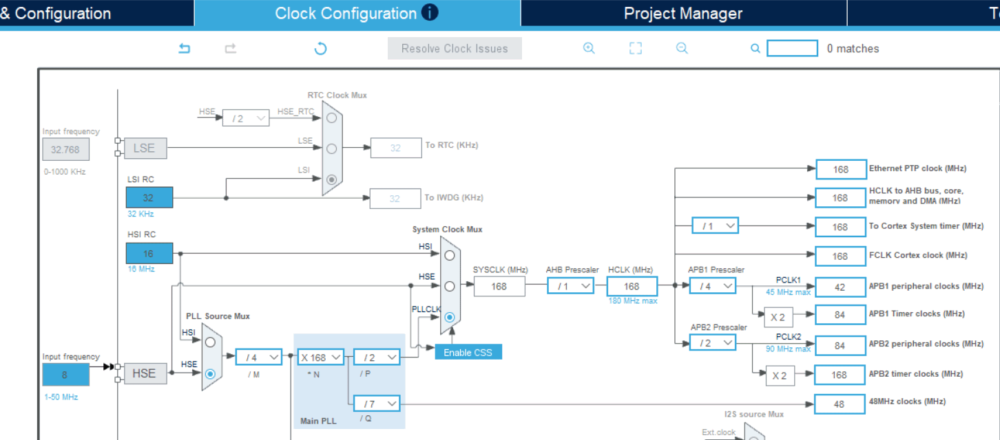
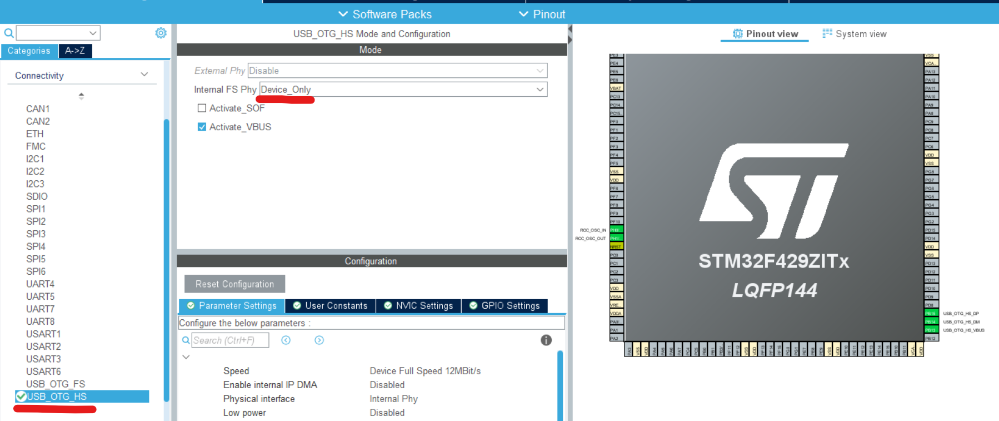
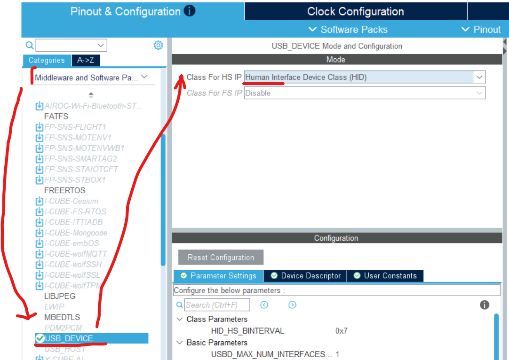

# Turn the STM32F429 into a mouse device when plugged into laptop

Lập trình cấu hình cổng USB-OTG trên STM32F429 thành thiết bị HID với profile của USB mouse. Thiết bị virtual mouse, STM32, sẽ gửi tọa độ ngẫu nhiên cho máy tính.



## Cấu hình trong STM CubeMX

### Thiết lập Clock

- RCC Mode configuration: 
- Clock Configuration: 

### Thiết lập USB Connection

- USB OTG HighSpeed: 
- USB HighSpeed HID: 

## Một vài dòng mã

- Cấu trúc dữ liệu cho mouse, để đóng gói thành gói tin HID. [my_usb_hid.h](./Core/Inc/my_usb_hid.h)

    ```C
    /** Cấu trúc dữ liệu cho mouse, để đóng gói thành gói tin HID*/
    typedef struct {
        uint8_t button;
        int8_t mouse_x;
        int8_t mouse_y;
        int8_t wheel;
    } mouseHID;
    ```

- Khai báo các biến trong [main.c](./Core/Src/main.c)

   ```C
    #include "usbd_hid.h"    //Bổ sung thư viện HID chuẩn, cấp thấp
    #include "my_usb_hid.h"  //Bổ sung thư viện HID Mouse, tự định nghĩa
    extern USBD_HandleTypeDef hUsbDeviceHS;
    mouseHID mousehid = {0, 0, 0, 0}; //Khởi tạo tọa độ mouse
   ```

- Gửi tọa độ chuột [main.c](./Core/Src/main.c)

    ```C
    mousehid.mouse_x = rand() % 1025;
    mousehid.mouse_y = rand() % 1025;
    USBD_HID_SendReport(&hUsbDeviceHS, (uint8_t *) &mousehid, sizeof(mousehid));
    HAL_Delay(1000);
  ```
